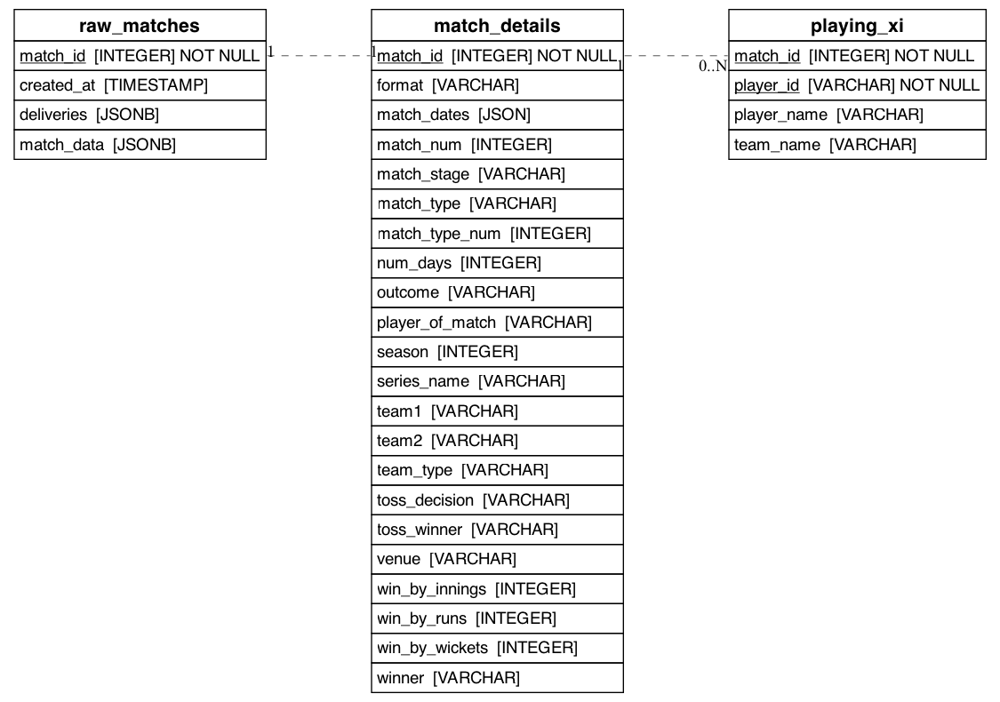

# Cricket Data Analysis Project

This project contains a set of dbt models for analyzing cricket match data. The models transform raw match data into structured tables that can be used for various analyses and insights.

## Available Models

### 1. raw_matches

This is the base model that contains the raw match data.

**Columns:**

- match_id
- match_data (JSONB containing all match details)

### 2. match_details

This model extracts key information from the raw match data.

**Columns:**

- match_id
- series_name
- match_num
- match_stage
- match_type
- match_type_num
- team_type
- format
- season
- player_of_match
- match_dates
- num_days
- venue
- toss_winner
- toss_decision
- outcome
- team1
- team2
- winner
- win_by_wickets
- win_by_runs
- win_by_innings

### 3. playing_xi

This model extracts the playing XI for each team in each match.

**Columns:**

- match_id
- player_id
- player_name
- team_name

## Relationships

The relationships between these models are as follows:

1. `raw_matches` is the source for both `match_details` and `playing_xi`.
2. `match_details` and `playing_xi` are linked by the `match_id` column.

You can visualize these relationships in the following diagrams:

- **ERD (Entity Relationship Diagram)**: 
- **DAG (Directed Acyclic Graph)**: 

## Data Ingestion

The raw match data is ingested into the `raw_matches` table using the code available in the [cricbit-hub repository](https://github.com/prateekb1912/cricbit-hub). This repository contains the necessary scripts and tools to fetch and load the cricket match data into our database.

For more details on the data ingestion process and to access the source code, please visit the [cricbit-hub GitHub repository](https://github.com/prateekb1912/cricbit-hub).
