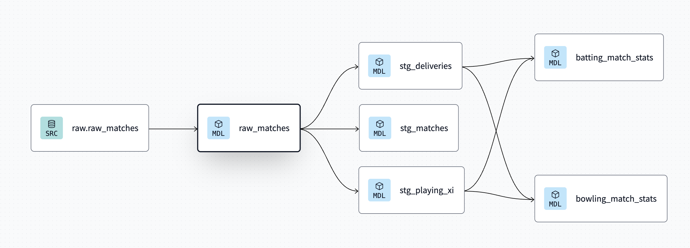

# Cricket Data Analysis Project

This project is designed to facilitate the analysis of cricket match data through a collection of dbt models. These models process raw match data into organized tables, enabling various analyses and insights.

## Models Available

### Source Model

1. raw_matches

### Staging Models

2. stg_playing_xi

3. stg_deliveries

4. stg_matches

### Intermediate Models

5. batting_match_stats

6. bowling_match_stats

## Data Relationships

- **DAG (Directed Acyclic Graph)**: 

## Data Integration

The raw match data is loaded into the `raw_matches` table using the scripts and tools provided in the [cricbit-hub repository](https://github.com/prateekb1912/cricbit-hub). This repository offers the necessary resources to collect and integrate cricket match data into our database.
